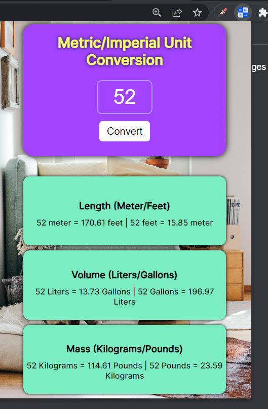

# Unit-Conversion-Extension


## Requirement: 


- You can change the color if  you want
- You can change sizes and dimension but design must remain same
- Design should change size or some colors when width increase from 600px. (design for mobile and Desktop)

## Code
### HTML
``` 
<!DOCTYPE html>
<html lang="en">
<head>
    <link rel="preconnect" href="https://fonts.googleapis.com">
    <link rel="preconnect" href="https://fonts.gstatic.com" crossorigin>
    <link href="https://fonts.googleapis.com/css2?family=Inter:wght@500&display=swap" rel="stylesheet">
    <link rel="stylesheet" href="style.css">
</head>
<body>
    <div class="main-clss">
        <div class="sub-1-clss">
            <h1 id="ttf">Metric/Imperial Unit Conversion</h1>
            <input type="text" id="txt" placeholder="0"><br>
            <button class="convert" id="btn-convt" >Convert</button>

        </div>
        <div class="sub-2-clss">
            <div class="sb22clss">
                <h3>Length (Meter/Feet)</h3>
                <p id="meter"> 0 meters = 0 feet | 0 feet = 0 meters</p>
            </div>
            <div class="sb22clss">
                <h3>Volume (Liters/Gallons)</h3>
                <p id="liter"> 0 Liters = 0 Gallons | 0 Gallons = 0 Liters</p>
            </div>
            <div class="sb22clss">
                <h3>Mass (Kilograms/Pounds)</h3>
                <p id="kilogram"> 0 Kilograms = 0 pounds| 0 pounds = 0 Kilograms</p>
            </div>
            
        </div>
    </div>
    <script src="index.js" > </script>
</body>
</html>
 ```

### CSS
[css files](style.css)
```
[css files](style.css)
```

### JavaScript
```

/* Conversion Factors
1 meter = 3.281 feet => 1feet =1/3.281 meter
1 liter = 0.264 gallon =>gallon= 1/0.264 liters
1 kilogram = 2.204 pound
*/
let magnitude=0;
console.log("mag=", magnitude)
const meter=document.getElementById("meter")
const liter=document.getElementById("liter")
const kilogram=document.getElementById("kilogram")

const buttn=document.getElementById("btn-convt")
buttn.addEventListener("click", function(){
    magnitude= Number(document.getElementById("txt").value);
    conversion(magnitude,3.281)
    conversion(magnitude,0.264)
    conversion(magnitude,2.204)
})
function conversion(mag,factor){
    let u1=0;
    let u2=0;
   //Meter and Feet
    
    u1=(mag*factor).toFixed(2);
    u2=((mag)*(1/factor)).toFixed(2);
    if(factor===3.281){
        render(u1, u2,"meter", "feet", meter); 
    }
    else if(factor===0.264){
        render(u1, u2,"Liters", "Gallons", liter); 
    }
    else{
        render(u1, u2,"Kilograms", "Pounds", kilogram); 
    }
       
}

function render(x,y,a,b,body ){
    body.innerHTML= `${magnitude} ${a} = ${x} ${b} | ${magnitude} ${b} = ${y} ${a} `;
    
}


```
### Manifest JSON
```
{
    "manifest_version": 3,
    "version": "1.0",
    "name": "Leads tracker",
    "action": {
        "default_popup": "index.html",
        "default_icon": "icon.png"
    }
}

```
## Preview after completion
 
 
## How to Add this Extension to Chrome
### Steps:
1) Download this repository
2) Open Chrome then setting and then click on extensions  or just copy paste this in search bar--> chrome://extensions/
3) Click on developer mode on
4) click on Load Unpack and choose folder that has been dowloaded.
5) Extension will be shown in extension panel.
